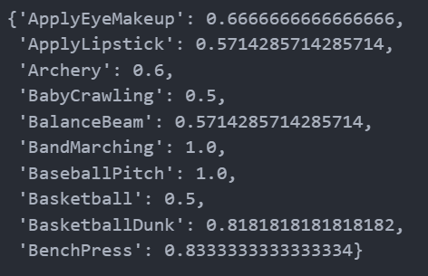

# Video Classification Project

[Undertook in 2023, Opened Github in 2024, Hence posting in 2024]

## Overview
This project aims to develop a video classification system using deep learning techniques. The system takes input videos and classifies them according to the content of those videos. The project utilizes the UCF101 dataset, which contains videos of various human actions.

## Requirements
- Python 3.x
- TensorFlow
- Keras
- OpenCV (cv2)
- Seaborn
- Matplotlib
- tqdm
- remotezip
- numpy
- einops

## Model Architecture
The video classification model is based on a custom 3D convolutional neural network (CNN) architecture. It consists of multiple residual blocks and convolutional layers, designed to extract high-level features from video frames and classify them based on these features.

The 3D convolutional neural network model is based off the paper [A Closer Look at Spatiotemporal Convolutions for Action Recognition](https://arxiv.org/abs/1711.11248v3). The paper compares several versions of 3D ResNets. Instead of operating on a single image with dimensions `(height, width)`, like standard ResNets, these operate on video volume `(time, height, width)`.

This code uses a (2 + 1)D convolution. The (2 + 1)D convolution allows for the decomposition of the spatial and temporal dimensions, therefore creating two separate steps. An advantage of this approach is that factorizing the convolutions into spatial and temporal dimensions saves parameters.

For each output location, a 3D convolution combines all the vectors from a 3D patch of the volume to create one vector in the output volume. This operation takes `time * height * width * channels` inputs and produces `channels` outputs (assuming the number of input and output channels are the same). So a 3D convolution layer with a kernel size of `(3 x 3 x 3)` would need a weight matrix with `27 * channels ** 2` entries.

The reference paper found that a more effective & efficient approach was to factorize the convolution. Instead of a single 3D convolution to process the time and space dimensions, they proposed a "(2+1)D" convolution which processes the space and time dimensions separately. 

The main advantage of this approach is that it reduces the number of parameters. In the (2 + 1)D convolution, the spatial convolution takes in data of the shape `(1, width, height)`, while the temporal convolution takes in data of the shape `(time, 1, 1)`. For example, a (2 + 1)D convolution with kernel size `(3 x 3 x 3)` would need weight matrices of size `(9 * channels**2) + (3 * channels**2)`, less than half as many as the full 3D convolution.

This tutorial implements (2 + 1)D ResNet18, where each convolution in the ResNet is replaced by a (2+1)D convolution.

## Training
The model is trained using video-caption pairs from the UCF101 dataset. The training process aims to minimize the discrepancy between the predicted captions and the ground truth captions. 

## Sample Outputs

The calculated precision and recall of the classification model using the ground truth and predicted values.

### The Precision Values

### The Recall Values

